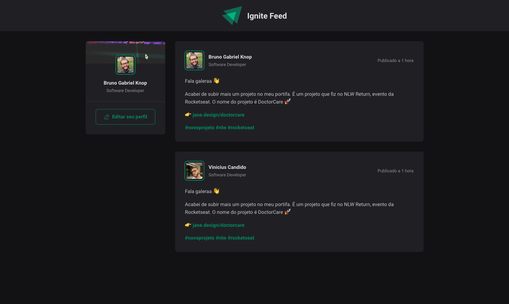

<h1 align="center"> IgniteFeed </h1>

  <a href="#-projeto">Projeto</a>&nbsp;&nbsp;&nbsp;|&nbsp;&nbsp;&nbsp;
  <a href="#-tecnologias">Tecnologias</a>&nbsp;&nbsp;&nbsp;|&nbsp;&nbsp;&nbsp;
  <a href="#-layout">Layout</a>&nbsp;&nbsp;&nbsp;|&nbsp;&nbsp;&nbsp;
  <a href="#memo-licença">Licença</a>

  

 

## 💻 Projeto
Este projeto é o front-end de um feed de comentários e é o objeto de estudo dos primeiros módulos de React, do curso [Ignite, da Rocketseat](https://www.rocketseat.com.br/ignite).

## 🚀 Tecnologias
Esse projeto foi desenvolvido com as seguintes tecnologias:
- React
- [Vite](https://vitejs.dev)

## 🔖 Layout
Você pode visualizar o layout do projeto através [DESSE LINK](https://www.figma.com/community/file/1113573231685349036). É necessário ter conta no [Figma](https://www.figma.com/) para acessá-lo.

## 📝 Licença
Esse projeto está sob a licença MIT.